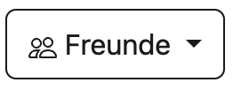

# Webseiten-Dokumentation: Collection Companion

### 1 Übersicht
#### 1.1 Einleitung
Die Website ist eine Such- und Filterplattform, die es ermöglicht mehrere Sammlungen zu erstellen und diese mit seinen Freunden zu teilen und zu bewerten. 

### 2 Benutzer Anmeldung und Registrierung
#### 2.1 Login Seite
Auf der Website ist es möglich, einen neuen Benutzer zu registrieren oder sich mit einem bereits registrierten Benutzer anzumelden. Auf der Login Seite wird nach einem Benutzernamen und einem Passwort gefragt. Der Nutzer kann entweder seine Benutzerdaten eingeben oder einen neuen Account erstellen. 

#### 2.1 Registrierungs Seite
Auf der Registierungs Seite wird der Nutzer gebeten, einen Benutzernamen, ein Passwort und eine E-Mail-Adresse einzugeben, um einen Account zu erstellen. Nachdem alle Felder ausgefüllt sind, kann der Nutzer auf den Registrierungsbutton drücken, um einen neuen Account zu erstellen.

### 3 Navigation und Funktionalität
#### 3.1 Startseite
Der Nutzer erreicht die Startseite nach seiner Anmeldung. Von hier aus hat der Benutzer die Möglichkeit, auf alle anderen weiteren Seiten zu navigieren, indem er die Buttons Links (Startseite, Account) und Rechts (Sammlung, Freunde) neben der Suchleiste nutzt. Die Hauptkomponente der Webseite ist die Suchleiste, welche es dem Benutzer ermöglicht, eine Kategorie auszuwählen und einen Suchbegriff einzugeben. Das bedeutet, dass das Internet nach dem Wort durchsucht wird und alle möglichen Ergebnisse in einer komprimierten anzeige dargestellt wird. Der Nutzer kann bestimmte Einträge in seine Sammlungen hinzufügen. Wenn der Nutzer einen Eintrag hinzufügen möchte, erscheint ein kleines Pop Up Fenster, in dem gefragt wird, in welche Sammlung der Eintrag gespeichert werden soll. 

#### 3.2 Benutzerdaten Seite  
Der Benutzer wird durch den Button "Account" auf die Webseite geführt, auf der er seine Anmeldeinformationen einsehen kann. Es besteht die Möglichkeit für den Benutzer, seinen Benutzernamen zu ändern und danach den Button "Speichern" zu drücken, um seine Änderungen zu speichern.

#### 3.3 Meine Sammlungen Seite 
Der Nutzer kann auf der Website eine Sammlung erstellen oder eine bereits erstellte Sammlung bearbeiten. Um eine Sammlung zu erstellen, klicken Sie auf den Button „Erstellen“. Daraufhin erscheint ein Pop-Up-Fenster, in dem der Name der Sammlung eingetragen, die Sichtbarkeit eingestellt und die Kategorie ausgewählt werden kann. Außerdem hat der Benutzer die Möglichkeit, einer seiner Sammlungen über den Button "Bearbeiten" zu bearbeiten. Wenn der Button gedrück wurde, öffnet sich ein weiteres Pop-Up-Fenster. Der Nutzer kann die Sichtbarkeit ändern und Sammlungseinträge entfernen.

#### 3.4 Freunde Seite 
Der Nutzer kann unter dem Reiter "Freunde" seine neu hinzugefügten Freunde anzeigen. Durch einen Klick auf einen Freund gelangt man auf eine andere Seite, auf der das Profil des Freundes angezeigt wird. Die Sammlungen des Freundes sind auf dem Profil sichtbar. Es ist möglich, diese zu bewerten, indem man entweder einen Daumen hoch oder einen Daumen runter verwendet. Außerdem besteht die Möglichkeit, eine Sammlung des Freunds sich anzusehen.